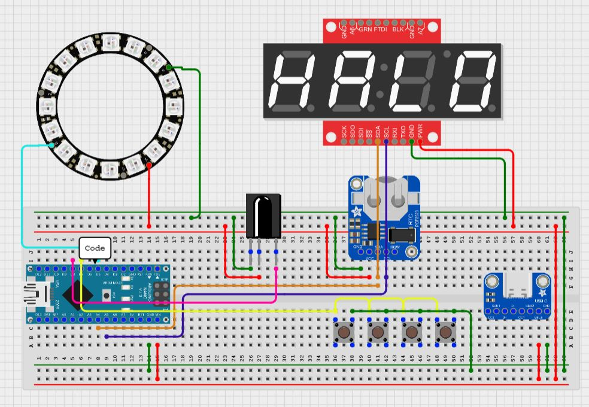
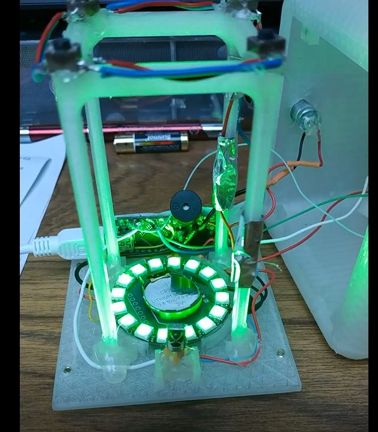

# arduino_sunrise_clock
I made this project to mimic the comercial sunrise clock that you can buy online but cheaper (at least it was cheaper in 2018)

This clock has two mains functions: 
- Anbiant RGB light with a large range of colors
- Sunrise mode which increase light gradually for 30 minutes

There is only one button on the top of the device which is used for:
- Switching ON/OFF the 7 segment display
- Switching OFF the ambiant light 
- Switching OFF the sunrise 

The others settings can be change with the remote control:
- Increse/decrese R G and B independetly and gradually
- Setting the time
- Setting the alarm clock
- Switching ON/OFF the alarm clock
- Switching ON/OFF the ambiant light

# Part list
| Part | Quantity | Cost |
|- | - | - |
| Arduino Nano | 1 | 5€ |
| RTC module | 1 | 5€ |
| RGB led ring | 1 | 5€ |
| USB-C connector | 1 | 1€ |
| 7 segments 4 digits display | 1 | 5€ |
| IR reciever | 1 | 0.5€ |
| IR remote | 1 | 5€ |
| Push button | 4 | 0.1€ |
| Clear filament spool | 1 | 20€ |


# 3D printing

The 3D files can be found [here] as stl and step if you want to adapt the design

The files are printed in clear filament which isn't clear but can difuse light efficiently.
Since any pieces are under constraint 2-3 wall are enougth but be carrefull to choose the right infil patern because it will be visible from the outside! 
I've choose to use a concentric infill patern for the top piece and a grid for the perimeter but feel free to try something elese.

# Wirring




# Assembly

All the components should fit easly on the bottom piece, a little bit of hot glue is required to maintain everything in place.
| Part | Quantity |
| - | - |
|  |  |


---
# tropfort
[read the wiki here](https://github.com/index-machines/index/wiki)
```
bl  blalala
```

